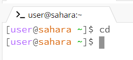
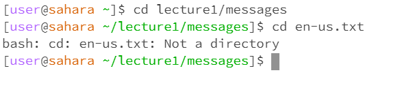
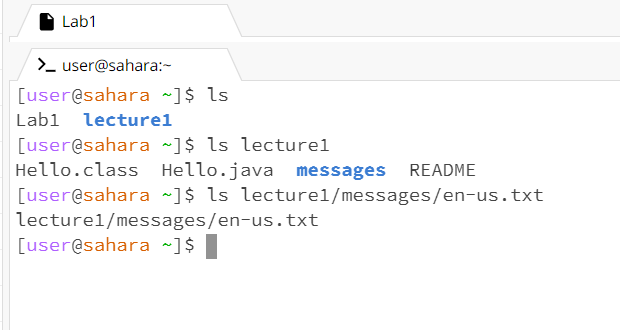

# Lab Report 1

  
  
  
  When the command was ran the working directory was the home directory. The output was not an error because the cd command means to change directory and when we give no arguments there is nothing to change the directory into. 

  
  ---
  
  
  The working directory was the home directory when we input the command cd with an argument to a directory path and the output was not an error becuase it changed our working directory to the directory path in the argument which is the purpose of the cd (change directory) command. 

The working directory was the messages directory when we input the command cd with an argument to a file path. The resulting output was an error because cd can only change the path to directories and not files.

---
  
  
