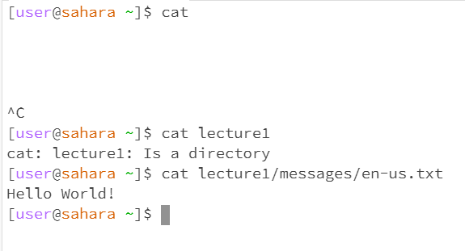

# Lab Report 1

  
  
  
  When the command was ran the working directory was the home directory. The output was not an error because the cd command means to change directory and when we give no arguments there is nothing to change the directory into. 

  
  
  
  The working directory was the home directory when we input the command cd with an argument to a directory path and the output was not an error becuase it changed our working directory to the directory path in the argument which is the purpose of the cd (change directory) command. 

The working directory was the messages directory when we input the command cd with an argument to a file path. The resulting output was an error because cd can only change the path to directories and not files.

---
  

The working directory is the home directory when inputing ls with no arguments. The output was not an error because it listed the directories/folders in the current working directory because when no arguments are given ls will just use the current directory.  

The working directory when entering ls with an argument to a directory path is the home directory. The output of this command is not an error and lists the directory folders in the argument which in this case is lecture1.

The working directory when inputing the command ls with an argument to a file path is still the home directory. The output seems to be correct because in a file there is no directories to be listed, so the command just gives the path as the output.

---

The current working directory when using the cat command with no arguments is the home directory. When running the command with no arguments the output is empty and continues until you stop it. I don't think it's an error because the cat command reads data from the file and prints its content and when you enter no arguments the output gives you no data and content because there is none.

When entering the cat command with an argument to a directory path the current working directory is the home directory. The output gives an error saying that the argument is a directory and the cat command only works with files.

The working directory when inputing the cat command with a file path argument is still the home directory. The output is not an error and prints out the content in the file argument which is "Hello World!". 
