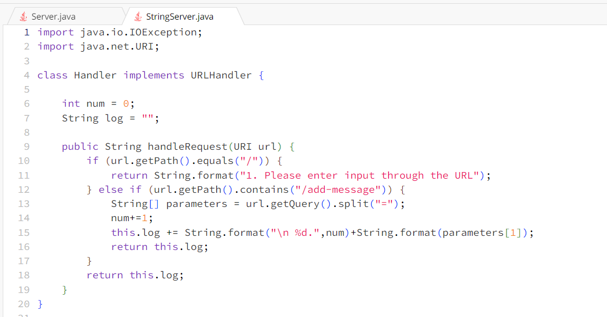
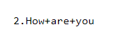

# Part 1

The handleRequest methods are called when running the code. The relevant argument is just the URL requests and spliting the URL. The values of the relevant fields of the class are the URIs and returning them as Strings and ints. The values of nums increment for every new line, the URI gets split into new strings, and strings are returned.
