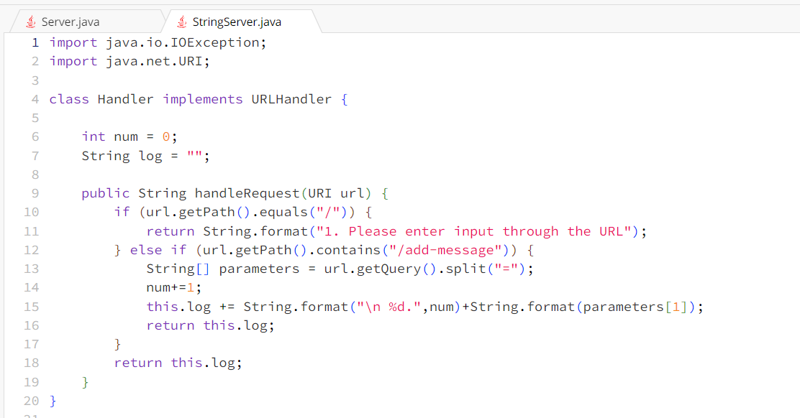
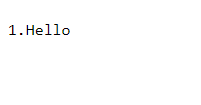
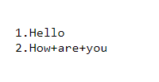
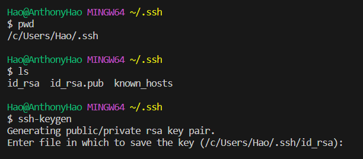
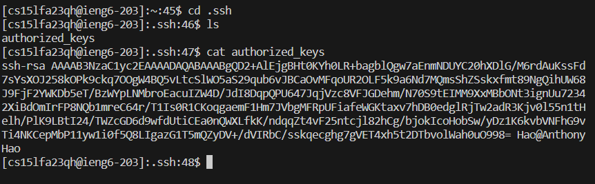
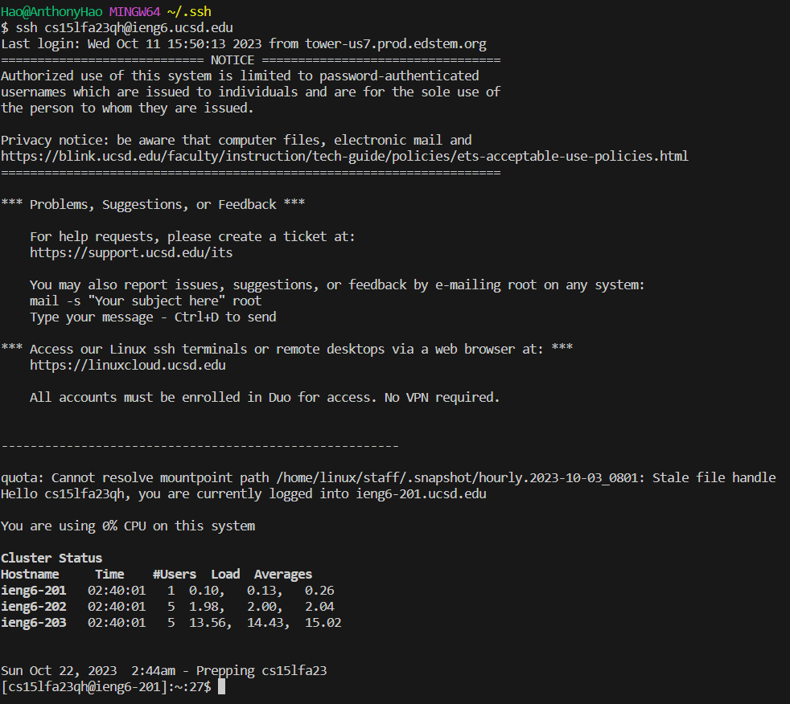

# Part 1

The handleRequest methods are called when running the code. The relevant argument is just the URL requests and spliting the URL. The values of the relevant fields of the class are the URIs and returning them as Strings and ints. Each time the url gets updated for a message the method handleRequest runs using the url as the argument, the method saves the message into "log" and returns it. Then values of nums increment for every new line with each url, the URI gets split into new strings, and strings are returned.

# Part 2

The path to the private key for my SSH key on my computer is located in file "id_rsa" under the .ssh folder. 

The path to the public key within the ieng6 account is in the file "authorized_keys" under the .ssh folder.

# Part 3
I learned that you can connect remotely to secure servers to work on your codes. The servers are stronger and protected making it great for programmers. Also, remote servers has separate folders than your own, but you can copy and tranfer them over to one another.
