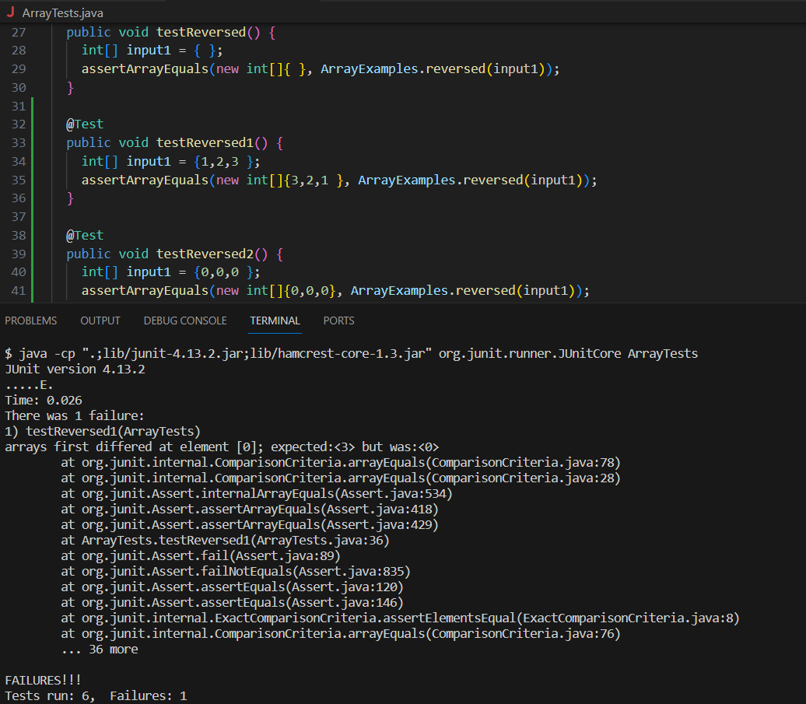

# Lab Report 3
## Part 1


I choose to use the reversed method as the bug to use from week's 4 lab.
 ``` 
  // A failure-inducing input for the buggy program
  @Test
  public void testReversed1() {
    int[] input1 = {1,2,3};
    assertArrayEquals(new int[]{3,2,1}, ArrayExamples.reversed(input1));
  }

  // An input that doesn’t induce a failure
  @Test
  public void testReversed2() {
    int[] input1 = {0,0,0};
    assertArrayEquals(new int[]{0,0,0}, ArrayExamples.reversed(input1));
  }
 ``` 



```
// Before
static int[] reversed(int[] arr) {
 int[] newArray = new int[arr.length];
 for(int i=0; i<arr.length; i+=1) {
  arr[i] = newArray[arr.length -i -1];
 }
 return arr;
}

// After
static int[] reversed(int[] arr) {
 int[] newArray = new int[arr.length];
 for(int i=0; i<arr.length; i+=1) {
  newArray[i] = arr[arr.length -i -1];
 }
 return newArray;
}
```


The goal of the code is to return a new array, so the first thing is that the before code returns the original array and not the new one. Then their code takes the elements of the new empty array and edits the original array which makes the whole array end with zeros for each element. So, the changes returns the new array and edits the new array with elements from the original array.


## Part 2


For the `find` command you can use; `-name`, `-type`, `-mtime`, and `-user` and for this I used the notes from the lecture presentation. When you use the command `man find` you can find the information about find that states, "the find utility shall recursively descend the directory hierarchy from each file specified by path."

```
// `-name` searches for files and directories that matches the "name" that we are looking for. It's useful for finding the path of a certain file/ directory name. The 'find' command will search every directory and file in the given path that matches the name that was given in the argument. In the first case we put in '.' as the path argument and then "chapter-1" as the name argument to search for and as an output we get a path to a file that has "chapter-1" in the file name. In the second case we still use the home directory but search for plos, the output returns a path to a directory with the name of the argument. These command will check the names of each directory and files in them from the path argument which for this is the home directory and it will return the path of each file or directory that matches or has the name argument in the file or directory name.  
$ find . -name "chapter-1"
./911report/chapter-1.txt

$ find . -name plos
./plos

//Sources: I used that notes from Professor Onat's "Lecture 8 presentation" (https://canvas.ucsd.edu/courses/49148/files/10645309?module_item_id=2011783).
For the codes, the ran them through VScode and edstem workspace.
(https://edstem.org/us/courses/41619/workspaces/)//


// `-type` returns all the files -f or diectories -d. It's useful for searching for files or directories when you have a lot to look through. For the `find -type` command we need to provide two arguments first is the path of where you want to search and the second is either `f` or `d` to search for files or directories. Then the output will return either all files in the path argument or all directories in the path argument. 
$ find . -type d
.
./911report
./biomed
./government
./government/About_LSC
./government/Alcohol_Problems
./government/Env_Prot_Agen
./government/Gen_Account_Office
./government/Media
./government/Post_Rate_Comm
./plos

$ find ./government/Alcohol_Problems/ -type f
./government/Alcohol_Problems/DraftRecom-PDF.txt
./government/Alcohol_Problems/Session2-PDF.txt
./government/Alcohol_Problems/Session3-PDF.txt
./government/Alcohol_Problems/Session4-PDF.txt

//Sources: I used that notes from Professor Onat's "Lecture 8 presentation" (https://canvas.ucsd.edu/courses/49148/files/10645309?module_item_id=2011783).
For the codes, the ran them through VScode and edstem workspace.
(https://edstem.org/us/courses/41619/workspaces/)//


// `-mtime` returns the files or directories that were modified in a given time. It's useful for finding the most recent file/directory edited. In order to use the `find -mtime` you will need to input two arguments; the path and modification time. The path argument is the path that you want to look in and the time argument will be in days since edited. The output will print all the files and directory in the path argument that were last modified and edited in the time day argument.
$ find ./government/Alcohol_Problems/ -mtime -3
./government/Alcohol_Problems/
./government/Alcohol_Problems/DraftRecom-PDF.txt
./government/Alcohol_Problems/Session2-PDF.txt
./government/Alcohol_Problems/Session3-PDF.txt
./government/Alcohol_Problems/Session4-PDF.txt

$ find ./government/ -mtime -1 -type d
./government/
./government/About_LSC
./government/Alcohol_Problems
./government/Env_Prot_Agen
./government/Gen_Account_Office
./government/Media
./government/Post_Rate_Comm

//Sources: I used that notes from Professor Onat's "Lecture 8 presentation" (https://canvas.ucsd.edu/courses/49148/files/10645309?module_item_id=2011783).
For the codes, the ran them through VScode and edstem workspace.
(https://edstem.org/us/courses/41619/workspaces/)//


// `-user` returns the file and directoies that were created by that user. It's useful for finding file and directory made by other users or yourself when working with others. The `find -user` command will also need two arguments, the path and the name of the user that you are looking for. The command will search for all files and directories in the given path that were created by the user argument and return the path of each or it will return a statement that says that the user is not the name of a known user if the user does not exist or is not a file or dierctory owner. 
$ find . -user Anthony
find: ‘Anthony’ is not the name of a known user

$ find ./911report/ -user Hao
./911report/
./911report/chapter-1.txt
./911report/chapter-10.txt
./911report/chapter-11.txt
./911report/chapter-12.txt
./911report/chapter-13.1.txt
./911report/chapter-13.2.txt
./911report/chapter-13.3.txt
./911report/chapter-13.4.txt
./911report/chapter-13.5.txt
./911report/chapter-2.txt
./911report/chapter-3.txt
./911report/chapter-5.txt
./911report/chapter-6.txt
./911report/chapter-7.txt
./911report/chapter-8.txt
./911report/chapter-9.txt
./911report/preface.txt

//Sources: I used that notes from Professor Onat's "Lecture 8 presentation" (https://canvas.ucsd.edu/courses/49148/files/10645309?module_item_id=2011783).
For the codes, the ran them through VScode and edstem workspace.
(https://edstem.org/us/courses/41619/workspaces/)//
```
