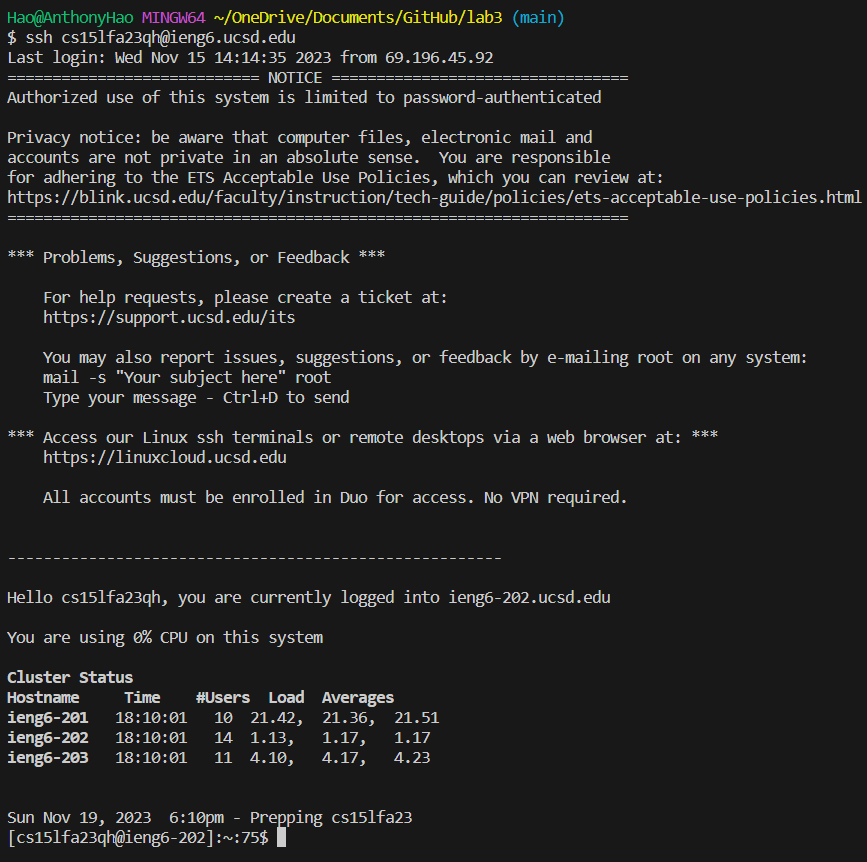
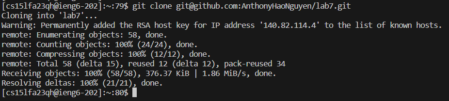
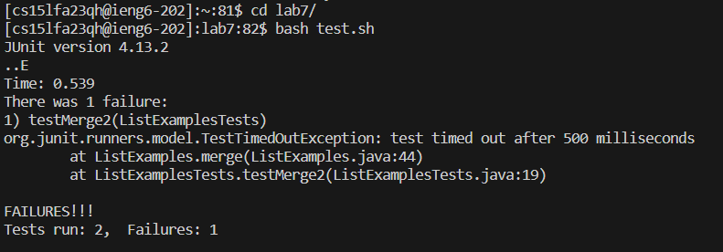
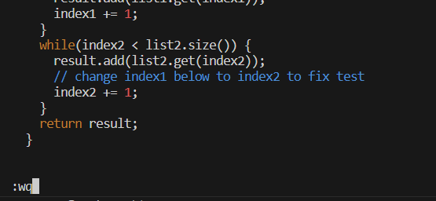
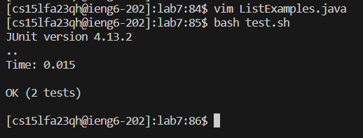
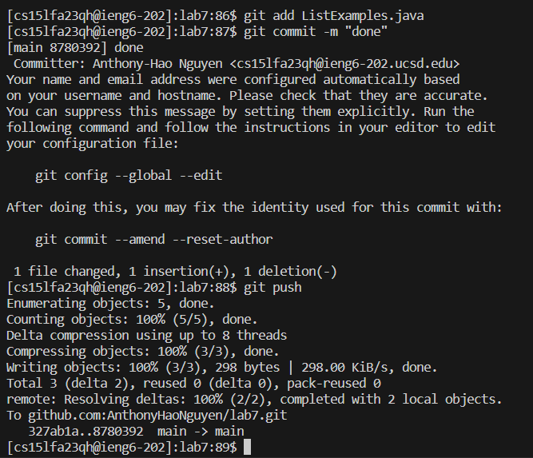

# Lab Report 4
## Log into ieng6

Keys Pressed: <up><enter>, the command `ssh cs15lfa23qh@ieng6.ucsd.edu` was one up in one command history and it logged me into my ieng6 account without needing my password. 
## Clone your fork of the repository from your Github account (using the SSH URL)

Keys Pressed: <Ctrl+R><G><Enter>, this searched my command history from lab7 to find the command `git clone git@github.com:AnthonyHaoNguyen/lab7.git` in order to clone the fork of the repository.
## Run the tests, demonstrating that they fail

Keys Pressed: I typed `cd l` and then <Tab><Enter> to get into the lab7 directory. Then <Ctrl+R><B><Enter>, this was where I got the command `bash test.sh` to run the tests.
## Edit the code file to fix the failing test

Keys Pressed: <Ctrl+R><V><Enter> got me into the command `vim ListExamples.java` to edit the file, <?>index1<enter>, <:>s/index1/index2<enter>, <:>wq<enter> 
## Run the tests, demonstrating that they now succeed

Keys Pressed: <up><up><enter>, this goes to the `bash test.sh` command to run the tests.
## Commit and push the resulting change to your Github account (you can pick any commit message!)

Keys Pressed: `git add ListExamples.java`, `git commit`, `git push`
