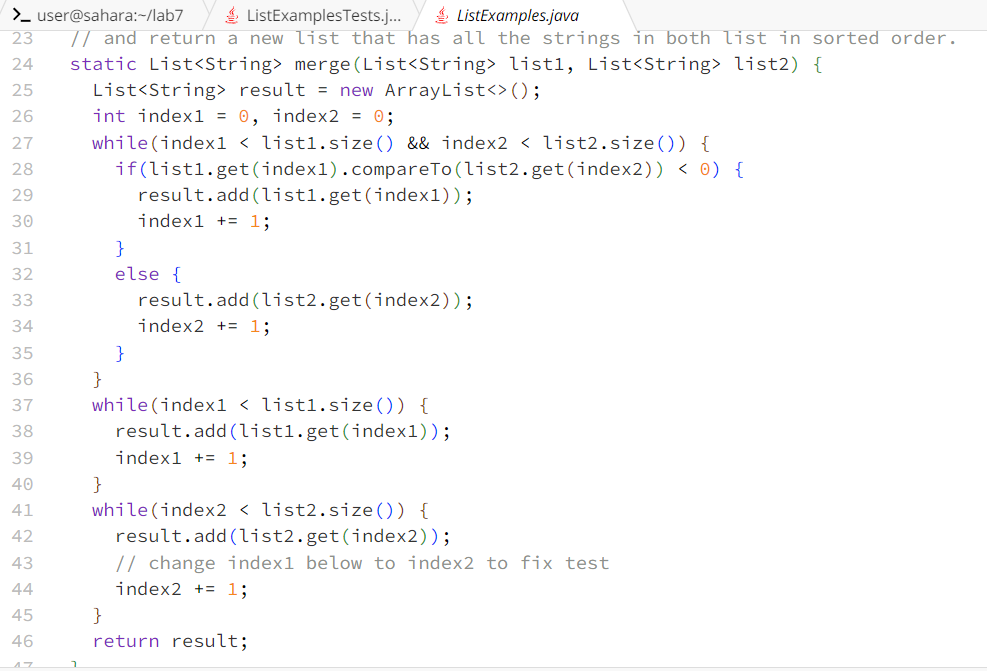
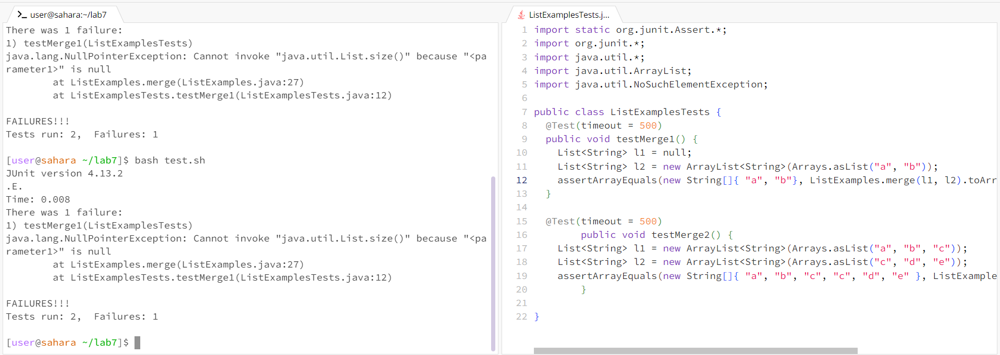
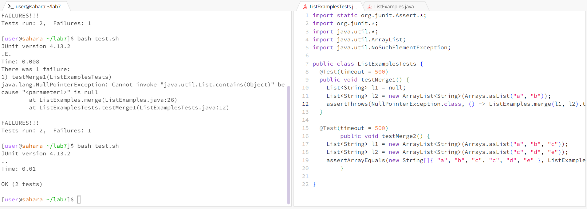
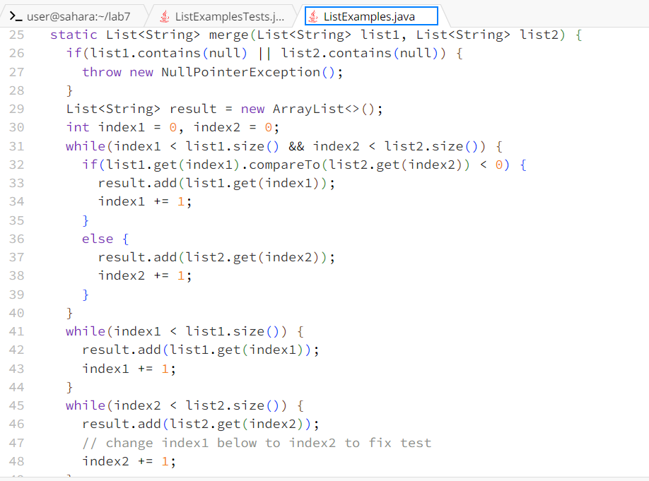

# Part 1
## 1. 
 

Hi, for my `merge` method whenever I enter a null object as one of the arguments, the test fails. Then, it gives an error output with a `NullPointerException` and I think the bug creates an error whenever we enter an argument that doesn't work with the `compareTo()` method.

## 2. 
For this, consider the `throw` command and think about what null is and trace through your code when null is inputed as an argument. Hope this helps and let me know if you need me to clarify anything. 

## 3. 

After trying the TA's response, the bug occured because the code didn't account for null because null is a special object that means the absence of a value, so it must be caught with some additional work in order to debug the bug. 

## 4.

The file and directory structure needed, and the contents of each file before fixing the bug is all from lab7 with some modifications, here: [Before fixing bug code](https://github.com/AnthonyHaoNguyen/lab7.git). 

To trigger the bug I just ran `bash test.sh` in the command line because the tests in `ListExamplesTests.java` file contains the usage of the `merge` method with null as an argument input.

In order to fix the bug, I changed the `assert` method test in `ListExamplesTests.java` to `assertThrows` to check if the null was caught when running the fixed code. Then I created a `throw NullPointerException` in the beginning of the code to catch if there was a null anywhere in both of the input arguments.

# Part 2

During the second half of this quarter, I learned about vim and more about how to edit github from the terminal. I found it really interesting how much you can do just from the terminal like editing the files through vim. Vim makes it so that you view and edit files from your terminal and if you forget something about vim you can also use `vimtutor` to find commands and how to use it. Then when your done you can use `git add`, `git commit`, and `git push` to update your github and those are just some of the interesting things that I learned from this quarter.
